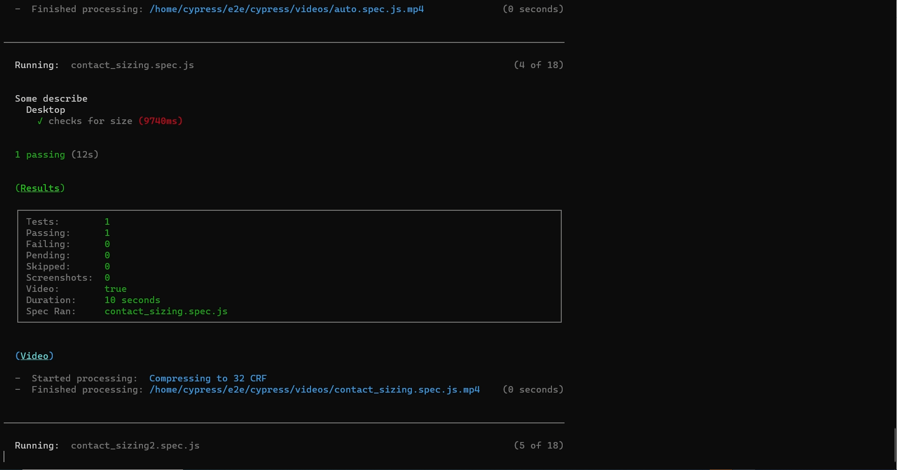

# Testing-Strategy

This project demonstrates one way to deploy **jenkins** on a **kubenetes** single node bare-metal cluster. Jenkins data is persisted externally via NFS share directory to persist system restarts. This pipeline will be used to build, test and deploy applications, webservices/webserver, and so much more. As each iteration of our application is committed to this version control tool, we will test the integrety of the application. If any failures occur, the deployment process will be rolled back, development will be notifed and corrections will be made before the processes is repeated, until all tests have passed. Then then app is deployed to your production environment or server.

---
---
## Testing with Cypress
We have used ***Cypress*** to conduct end-to-end testing within an isolated jenkins environment. Upon each commit as tests are updated for the current version under development, qa writes tests scripts/specs that jenkins will employ to test against newly checked in code or updates to our application.  
 
Upon each iteration Cypress will be rebuilt via [cypress.Dockerfile](./cypress.Dockerfile).  Once the environment is setup we get a snapshot of our testing environment in the form of a docker image ([dalexander2israel/cypress_included:5.4.0](./cypress.Dockerfile)). The custom image is now ready to spin up any time we need to run any tests suite as need.  Each Jenkins testing environment is also equipt with docker and kubernetes support using access credentials.  see [JENKINS_README](kubernetes\jenkins\JENKINS_READ.md). 

---
---

## Jenkins Demo Video

.... <!-- post content -->

.... <!-- post content -->
