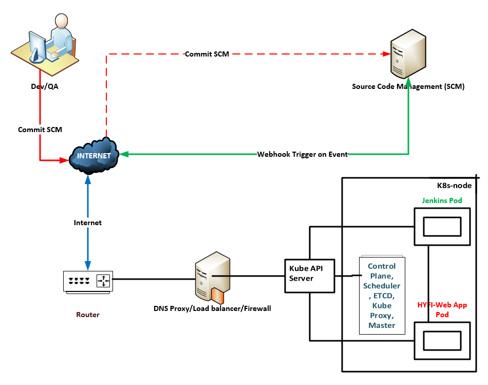

# Testing-Strategy

This project demonstrates one way to deploy `Jenkins` on a `Kubernetes` single node bare-metal cluster. Jenkins data is persisted externally via NFS share directory to persist system restarts. This pipeline will be used to build, test and deploy applications, webservices/webserver, and so much more. As each iteration of our application is committed to this version control tool, we will test the integrety of the application. If any failures occur, the deployment process will be rolled back, development will be notifed and corrections will be made before the processes is repeated, until all tests have passed. Then the app is deployed to your production environment or server.

---
---

## Jenkins Kubernetes Pipeline Topology
<hr/>

### CI/CD: Pipeline Lifecycle Breakdown:<br/>
&nbsp;&nbsp;&nbsp;&nbsp;&nbsp;&nbsp;`Dev/QA`: makes a commit to SCM<br/>
&nbsp;&nbsp;&nbsp;&nbsp;&nbsp;&nbsp;|&nbsp;&nbsp;&nbsp;&nbsp;&nbsp;&nbsp;|__ `SCM Server`: receives the commit and triggers a build event to Jenkins Server<br/>
&nbsp;&nbsp;&nbsp;&nbsp;&nbsp;&nbsp;|&nbsp;&nbsp;&nbsp;&nbsp;&nbsp;&nbsp;|&nbsp;&nbsp;&nbsp;&nbsp;&nbsp;&nbsp;&nbsp;|__ `Jenkins Pod`: receives the request and initiates a build event on the branch<br/>
&nbsp;&nbsp;&nbsp;&nbsp;&nbsp;&nbsp;|&nbsp;&nbsp;&nbsp;&nbsp;&nbsp;&nbsp;|&nbsp;&nbsp;&nbsp;&nbsp;&nbsp;&nbsp;&nbsp;&nbsp;&nbsp;&nbsp;&nbsp;|__ `if (branch ==~ '(master|main)') && if ('BUILD_RESULTS' ==~ '(success)'):` Deploy to Prod <br/>
&nbsp;&nbsp;&nbsp;&nbsp;&nbsp;&nbsp;|&nbsp;&nbsp;&nbsp;&nbsp;&nbsp;&nbsp;|&nbsp;&nbsp;&nbsp;&nbsp;&nbsp;&nbsp;&nbsp;&nbsp;&nbsp;&nbsp;&nbsp;| &nbsp;&nbsp;&nbsp;&nbsp;&nbsp;&nbsp;&nbsp;&nbsp;&nbsp;&nbsp;&nbsp;&nbsp;&nbsp;(Notify Github SCM)<br/>
&nbsp;&nbsp;&nbsp;&nbsp;&nbsp;&nbsp;|&nbsp;&nbsp;&nbsp;&nbsp;&nbsp;&nbsp;|&nbsp;&nbsp;&nbsp;&nbsp;&nbsp;&nbsp;&nbsp;&nbsp;&nbsp;&nbsp;&nbsp;|__ `else`: Do Nothing (Notify Github SCM server of `BUILD_RESULTS`)<br/>
&nbsp;&nbsp;&nbsp;&nbsp;&nbsp;&nbsp;| ___| _______|
<br/><br/>
<hr/>




---
---
## Testing with Cypress
<br/>
We have used `Cypress` to conduct end-to-end testing within an isolated jenkins environment. Upon each commit/push from QA to the repo, the repo will trigger a event to Jenkins to pull both the testing repository and the applicaiton repository, rebuild both images and run a live test on the current stable webservice. Or upon a commit/push from Dev a build event is triggered to test the new code commited to the repo against stable working test.  This also includes regression testing on prior working units. QA will write test scripts/specs that jenkins will employ to test against your application code.  
<br/>

Upon each iteration Cypress will be rebuilt via [cypress.Dockerfile](./cypress.Dockerfile) and the `Webserver application and test in isolation`.  Once the environment is setup we get a snapshot of our testing environment in the form of a docker image:
-  ([<Some_Docker_User_Account>/cypress_included:5.4.0](./cypress.Dockerfile)). 

The custom image is now ready to spin up any time we need to run any tests suite as need.  Each Jenkins testing environment is also equipt with docker and kubernetes support using access credentials.  see [JENKINS_README](./kubernetes/jenkins/JENKINS_READ.md). 

---
---

## CI/CD Pipeline Build


The pipeline build has been automated using the *[Jenkinsfile](./Jenkinsfile)*, which will be executed inside the Jenkins Pod to kick-off the build process.

You may use various methods to define a jenkins build. For the purpose of this project we emply a `Jenkinsfile` to automate our pipeline.


---

### Build Stages:
<br/>

**This process has been automated for ease of use upon script execution:**
<br/>

A. The environment is cleansed of any old version of the repo. 

B. A new copy of the repo is cloned into a jenkins workspace.  See below for details.

```Groovy
pipeline{
    agent any
    options { // Terminal color tool: # Red RD='\e[31m' # Green GR='\e[32m' # Blue BL='\e[36m' $ Cap NC='\e[0m\n'
        ansiColor('xterm')
    }
    environment { // Define some environment variables
        // DOCKER_CERT_PATH is automatically picked up by the Docker client
        // Usage: $DOCKER_CERT_PATH or $DOCKER_CERT_PATH_USR or $DOCKER_CERT_PATH_PSW
        DOCKER_CERT_PATH = credentials('PRIVATE_CNTR_REGISTRY')
        RD='\e[31m' // Red
        GR='\e[32m' // Green
        BL='\e[36m' // Blue
        NC='\e[0m'  // CAP
    }
    stages {
        stage('Build Test Images...'){
            steps {
                script {
                    // Define a some variables
                    env.BUILD_RESULTS="failure"
                    def cypress_image
                    def cypress_dockerfile
                    
                    try{ // try and catch errors
                        // Test environment...
                        sh '''
                        ls -lia;
                        env;
                        '''
                        // name the dockerfile
                        cypress_dockerfile = 'cypress.Dockerfile'
                        // build the cypress test image
                        cypress_image = docker.build("cypress/custom:${env.BUILD_ID}", "-f ${cypress_dockerfile} .")
                        // Login to private container registry:
                        //   - [ registry.dellius.app ]                  
                        sh '''
                        docker login -u $DOCKER_CERT_PATH_USR -p $DOCKER_CERT_PATH_PSW registry.dellius.app;
                        '''
                        // tag the cypress image to private repository
                        sh '''
                        docker tag cypress/custom:${BUILD_ID} registry.dellius.app/cypress/custom:v5.4.0;
                        '''
                        // Push image to private container registry
                        sh '''
                        docker push registry.dellius.app/cypress/custom:v5.4.0;
                        '''
                        // capture your success
                        env.BUILD_RESULTS="success"
                        sh '''
                        printf "\n${GR}Intermediate build ${BUILD_RESULTS}......${NC}\n";
                        '''
                    }
                    catch(e){
                        // capture your failures
                        env.BUILD_RESULTS="failure"
                        sh '''
                        echo "${RD}Intermediate build ${BUILD_RESULTS}......${NC}";
                        '''
                        throw e
                    }
                    cleanWs() // clean up workspace post-Build
                } // End of script block
            } // Enc of steps()
        } // End of Build Test images stage()
        stage('Testing image cypress/custom:v5.4.0'){ // Testing stage()
            steps('Testing Responsive Web Design Webserver'){
                script{ // Run our newly created test image
                    try{
                        sh '''
                        docker run --cap-add=sys_nice \
                        --ulimit rtprio=99 \
                        --memory=1024m \
                        -v ${PWD}/cypress_tests/:/home/cypress/e2e/cypress/integration/cypress_tests \
                        -v ${PWD}/video:/home/cypress/e2e/cypress/videos/ \
                        -e DEBUG='' \
                        -e PAGELOADTIMEOUT=60000 \
                        -e CYPRESS_RECORD_KEY="U2FyYWlAMjAwOQ==" \
                        -w /home/cypress/e2e --entrypoint=cypress \
                        registry.dellius.app/cypress/custom:v5.4.0  \
                        run --headless --browser firefox --spec "/home/cypress/e2e/cypress/integration/*";
                        '''
                        // capture your success
                        env.BUILD_RESULTS="success"
                        sh '''
                        printf "\n${GR}Intermediate build ${BUILD_RESULTS}......${NC}\n";
                        '''
                    }
                    catch(e){
                        // capture your failures
                        env.BUILD_RESULTS="failure"
                        sh '''
                        echo "${RD}Intermediate build ${BUILD_RESULTS}......${NC}";
                        '''
                        throw e
                    }
                    cleanWs() // clean up workspace post-Testing
                } // End of script block
            } // Enc of steps()
        } // End of Testing stage()
        stage('Check environment'){ // check the status of environment variables
            steps{
                sh '''
                echo "Build Results: ${BUILD_RESULTS}";
                echo "Working with Branch: ${GIT_BRANCH}";
                '''
            }
        }
        stage('Deploy Webservice to Prod...'){
            when {
                branch 'main'
                environment name: 'BUILD_RESULTS', value: 'success'
            }
            steps('Deploy Webservice to Cloud...'){
                script{ // Re-Deploy to Production cloud environment
                    try{
                        sh '''
                        git clone https://github.com/dellius-alexander/responsive_web_design.git;
                        cd responsive_web_design;
                        kubectl apply -f hyfi-k8s-deployment.yaml;
                        '''
                        // capture your success
                        env.BUILD_RESULTS="success"
                        sh '''
                        printf "\n${GR}Intermediate build ${BUILD_RESULTS}......${NC}\n";
                        '''
                    }
                    catch(e){
                        // capture your failures
                        env.BUILD_RESULTS="failure"
                        sh '''
                        echo "${RD}Intermediate build ${BUILD_RESULTS}......${NC}";
                        '''
                        throw e
                    }
                    cleanWs() // clean up workspace post-Deploy
                } // End of script block
            } // Enc of steps()            
        } // End of Deploy to Prod stage()
    } // End of Main stages
    post { // Notifications on failures
        failure {
            emailext body: "${env.GIT_AUTHOR_NAME}, Job Name: ${env.JOB_NAME} : #${env.BUILD_NUMBER}  : Results URL: ${env.RUN_DISPLAY_URL}",
                to: "${env.GIT_AUTHOR_EMAIL}",
                subject: "Failed Pipeline Job -> ${env.JOB_NAME} : ${env.currentBuild.fullDisplayName} : Results -> ${env.currentBuild.currentResult}",
                recipientProviders: [developers(), requestor()]
        }
    }
} // End of pipeline
```

---
### <a id="demo-video">See Demo Video</a>
.... <!-- post content -->

[](https://www.youtube.com/embed/jFOrcgQPZ1k "Jenkins")

.... <!-- post content -->
